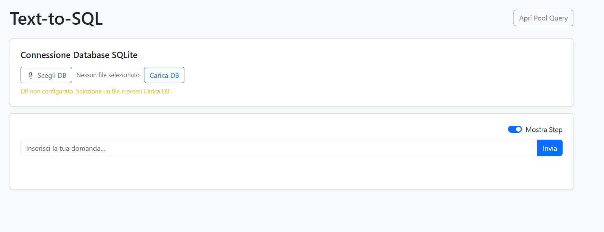

# Text-to-SQL: Versione 1 e Versione 2

Repository per interrogare database con linguaggio naturale usando Ollama in locale.

Il progetto contiene due varianti indipendenti:

- Versione 1: pipeline MySQL/Northwind (moduli originali: `api.py`, `ask.py`)
- Versione 2: pipeline SQLite con selezione/upload DB da UI (moduli: `api2.py`, `ask2.py`)

Entrambe generano solo query di lettura (`SELECT`) e usano RAG su pool locale.

## HomePage




## Panoramica Rapida

| Variante | Entry point web | Entry point CLI | Database |
|---|---|---|---|
| V1 | `python app/api.py` | `python app/services/ask.py` | MySQL (Northwind) |
| V2 | `python app/api2.py` | `python app/services/ask2.py` | SQLite (file `.db/.sqlite/.sqlite3`) |

UI web (entrambe): `http://localhost:8000`

## Prerequisiti Comuni

- Python 3.10+
- Ollama installato e attivo su `http://localhost:11434`
- Modello disponibile: `qwen2.5-coder`

Installa dipendenze:

```bash
pip install -r requirements.txt
```

Avvia Ollama (in un terminale separato):

```bash
ollama serve
ollama pull qwen2.5-coder
```

## Versione 1 (MySQL / Northwind)

### 1) Prepara il DB MySQL

Esegui gli script in ordine:

```bash
mysql -u root -p -e "CREATE DATABASE IF NOT EXISTS northwind;"
mysql -u root -p northwind < init_db/01-northwind.sql
mysql -u root -p northwind < init_db/02-northwind-data.sql
```

### 2) Configura variabili ambiente (consigliato)

La V1 usa `app/core/config.py`.

```bash
set DB_HOST=localhost
set DB_USER=root
set DB_PASSWORD=la_tua_password
set DB_NAME=northwind
set OLLAMA_URL=http://localhost:11434/api/generate
```

Nota: se `DB_PASSWORD` non è impostata, la V1 richiede input password da terminale (`getpass`).

### 3) Avvio V1

Web API + UI:

```bash
python app/api.py
```

CLI interattiva:

```bash
python app/services/ask.py
```

## Versione 2 (SQLite dinamico)

La V2 usa `app/core/config2.py` e non richiede MySQL.

### 1) Avvio V2

Web API + UI:

```bash
python app/api2.py
```

CLI interattiva:

```bash
python app/services/ask2.py
```

### 2) Selezione database nella V2

- Da UI (`/`): carica un file SQLite oppure imposta path DB
- Endpoint disponibili:
  - `POST /api/set-db` con body JSON `{ "db_path": "percorso/al/file.sqlite" }`
  - `POST /api/upload-db` (upload binario del file)

Estensioni file supportate upload: `.sqlite`, `.sqlite3`

Nota: se non trovi un Dataset iniziale valido, la V2 parte comunque, ma richiede configurazione Dataset dalla UI prima di eseguire domande.

## Endpoint principali (entrambe le versioni)

- `GET /api/health` stato servizio
- `POST /api/ask` domanda NL -> SQL + risultati
- `POST /api/save` feedback utente (query corretta/non corretta)
- `GET /api/pool` elenco esempi RAG
- `POST /api/pool/execute` esegue query `SELECT` dal pool

## Docker

Nel repository sono presenti due compose:

- `docker-compose.yml`: stack V2 (SQLite) + Ollama
- `docker-compose2.yml`: stack V1 (MySQL Northwind) + Ollama

Avvio V2:

```bash
docker-compose up --build
```

Avvio V1:

```bash
docker-compose -f docker-compose2.yml up --build
```

Servizi:

- App: `http://localhost:8000`
- Ollama API: `http://localhost:11434`
- MySQL (solo V1): `localhost:3307`

## Differenze funzionali V1 vs V2

- V1: schema fisso Northwind su MySQL
- V2: schema variabile, scelto dall'utente su SQLite


