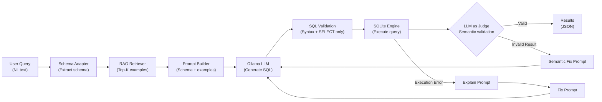

<p align="center">
  <h1 align="center">🗃️ Text-to-SQL</h1>
  <p align="center">
    <strong>Query SQLite databases in natural language using local LLMs via Ollama</strong>
  </p>
  <p align="center">
    <a href="#-quick-start">Quick Start</a> •
    <a href="#-features">Features</a> •
    <a href="#%EF%B8%8F-architecture">Architecture</a> •
    <a href="#-api-reference">API Reference</a> •
    <a href="#-benchmarks">Benchmarks</a> •
    <a href="#-docker">Docker</a>
  </p>
</p>

---

## 📽️ Example of Usage


https://github.com/user-attachments/assets/e9c66e03-d062-4ca9-8e58-80bd3dec43bd


---

## ✨ Features

| Feature | Description |
|---|---|
| 🗣️ **Natural Language Queries** | Ask questions in plain language and get back SQL queries with results |
| 🔄 **RAG-enhanced Generation** | Retrieval-Augmented Generation with a local example pool improves accuracy |
| 📂 **Upload or Select DB** | Load SQLite databases via file upload or filesystem path |
| 🔒 **Read-only by Design** | Only `SELECT` queries are generated — no risk of data mutation |
| 🌐 **Web UI + REST API** | Full-featured web interface and API endpoints for integration |
| 💻 **Interactive CLI** | Terminal-based interface for quick queries without a browser |
| 🐳 **Docker Ready** | One-command deployment with Docker Compose (app + Ollama) |
| 📊 **Built-in Benchmarks** | Evaluate accuracy against Gretel.ai and Spider datasets |

---

## 🚀 Quick Start

### Prerequisites

| Requirement | Version |
|---|---|
| Python | 3.10+ |
| [Ollama](https://ollama.com) | Latest |
| LLM Model | `qwen2.5-coder` (default) |

### 1. Install dependencies

```bash
pip install -r requirements.txt
```

### 2. Start Ollama and pull the model

```bash
ollama serve                # start the Ollama server (in a separate terminal)
ollama pull qwen2.5-coder   # download the default model
```

### 3. Launch the application

**Web UI + API** (recommended):

```bash
python app/api.py
```

Then open **http://localhost:8000** in your browser.

**Interactive CLI**:

```bash
python app/services/ask.py
```

---

## 🏗️ Architecture

```
Text-to-SQL/
├── app/
│   ├── api.py                  # FastAPI server — Web UI + REST API
│   ├── core/
│   │   └── config.py           # Centralized configuration (model, paths, RAG params)
│   ├── services/
│   │   ├── ask.py              # Core pipeline: NL → prompt → LLM → SQL → execute
│   │   ├── retriever.py        # RAG retriever (cosine similarity over sentence embeddings)
│   │   └── schema_adapter.py   # SQLite schema extraction and formatting
│   └── templates/
│       ├── index.html          # Main web UI
│       └── pool.html           # RAG pool management page
├── benchmark/
│   ├── test_gretelai_*.py      # Benchmark on the Gretel.ai dataset
│   ├── test_spider.py          # Benchmark on the Spider dataset
│   ├── benchmark_ablation.py   # Ablation study for pipeline components
│   └── summarize_benchmark_results.py  # Aggregate results → MD / CSV / JSON / PDF
├── data/                       # Uploaded databases & RAG pool (gitignored)
├── demo/                       # Simplified demo app
├── Dockerfile
├── docker-compose.yml
└── requirements.txt
```

### Pipeline Overview


```mermaid
flowchart LR
    A["User Query<br/>(NL text)"]
    B["Schema Adapter<br/>(Extract schema)"]
    C["RAG Retriever<br/>(Top-K examples)"]
    D["Prompt Builder<br/>(Schema + examples)"]
    E["Ollama LLM<br/>(Generate SQL)"]
    F["SQL Validation<br/>(Syntax + SELECT only)"]
    G["SQLite Engine<br/>(Execute query)"]
    H{"LLM as Judge<br/>Semantic validation"}
    I["Results<br/>(JSON)"]

    J["Explain Prompt"]
    K["Fix Prompt"]
    L["Semantic Fix Prompt"]

    A --> B
    B --> C
    C --> D
    D --> E
    E --> F
    F --> G
    G --> H

    H -->|Valid| I
    H -->|Invalid Result| L
    L --> E

    G -->|Execution Error| J
    J --> K
    K --> E
```
## 🌐 API Reference

The application exposes a RESTful API at `http://localhost:8000`.

### Endpoints

| Method | Endpoint | Description |
|---|---|---|
| `GET` | `/api/health` | Service health check |
| `POST` | `/api/set-db` | Set database from a filesystem path |
| `POST` | `/api/upload-db` | Upload a SQLite file (`.db`, `.sqlite`, `.sqlite3`) |
| `POST` | `/api/ask` | Submit a natural language question → receive SQL + results |
| `POST` | `/api/save` | Submit user feedback on a generated query (feeds the RAG pool) |
| `GET` | `/api/pool` | List all RAG pool examples |
| `POST` | `/api/pool/execute` | Execute a `SELECT` query from the pool |

### Example: Ask a question

```bash
curl -X POST http://localhost:8000/api/ask \
  -H "Content-Type: application/json" \
  -d '{"question": "How many customers are there?"}'
```

---

## 📊 Benchmarks

The project includes benchmark scripts to evaluate SQL generation accuracy on public datasets.

### Supported Datasets

| Dataset | Script | Description |
|---|---|---|
| [Gretel.ai Synthetic Text-to-SQL](https://huggingface.co/datasets/gretelai/synthetic_text_to_sql) | `test_gretelai_synthetic_text_to_sql.py` | Synthetic NL→SQL pairs |

### Run a benchmark

```bash
# Gretel.ai benchmark
python benchmark/test_gretelai_synthetic_text_to_sql.py -q
```

### Aggregate results

Results are saved as JSON files in `results/`. Use the summary script to generate reports:

```bash
# Markdown table (stdout)
python benchmark/summarize_benchmark_results.py --results-dir results --format md

# CSV export
python benchmark/summarize_benchmark_results.py --results-dir results --format csv --output results/summary.csv

# JSON export
python benchmark/summarize_benchmark_results.py --results-dir results --format json --output results/summary.json

# PDF report
python benchmark/summarize_benchmark_results.py --results-dir results --format pdf --output results/benchmark_summary.pdf
```

### Ablation study

Evaluate the contribution of individual pipeline components:

```bash
python benchmark/benchmark_ablation.py
```

---

## 🐳 Docker

A `docker-compose.yml` is provided for a fully containerized deployment.

### Start the stack

```bash
docker-compose up --build
```

### Services

| Service | URL | Description |
|---|---|---|
| **App** | http://localhost:8000 | Main Web UI + API |
| **Demo App** | http://localhost:8001 | Simplified demo interface |
| **Ollama** | http://localhost:11434 | LLM inference server |

> **Note:** The `ollama-pull-model` service automatically downloads `qwen2.5-coder` on first startup.

---

## ⚙️ Configuration

All configurable parameters are centralized in [`app/core/config.py`](app/core/config.py):

| Parameter | Default | Description |
|---|---|---|
| `LLM_MODEL` | `qwen2.5-coder:latest` | Ollama model used for SQL generation |
| `OLLAMA_URL` | `http://localhost:11434/api/generate` | Ollama API endpoint (override via `OLLAMA_URL` env var) |
| `EMBEDDING_MODEL` | `all-mpnet-base-v2` | Sentence-Transformers model for RAG embeddings |
| `TOP_K` | `5` | Number of RAG examples to retrieve |

---

## 🛠️ Tech Stack

| Component | Technology |
|---|---|
| **Backend** | [FastAPI](https://fastapi.tiangolo.com/) + [Uvicorn](https://www.uvicorn.org/) |
| **LLM Inference** | [Ollama](https://ollama.com) (local) |
| **Database** | SQLite |
| **RAG Embeddings** | [Sentence-Transformers](https://www.sbert.net/) (`all-mpnet-base-v2`) |
| **SQL Validation** | [sqlglot](https://github.com/tobymao/sqlglot) |
| **Similarity Search** | [scikit-learn](https://scikit-learn.org/) (cosine similarity) |
| **Templating** | [Jinja2](https://jinja.palletsprojects.com/) |
| **Containerization** | Docker + Docker Compose |

---

## 📄 License

This project was developed as a university thesis at the **University of Salento**.
