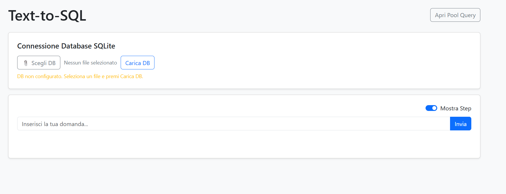

# Text-to-SQL: Versione 1 e Versione 2

Repository per interrogare database con linguaggio naturale usando Ollama in locale.

Il progetto contiene due varianti indipendenti:

- Versione 1: pipeline MySQL/Northwind (moduli originali: `api.py`, `ask.py`)
- Versione 2: pipeline SQLite con selezione/upload DB da UI (moduli: `api2.py`, `ask2.py`)

Entrambe generano solo query di lettura (`SELECT`) e usano RAG su pool locale.

## HomePage




## Panoramica Rapida

| Variante | Entry point web | Entry point CLI | Database |
|---|---|---|---|
| V1 | `python app/api.py` | `python app/services/ask.py` | MySQL (Northwind) |
| V2 | `python app/api2.py` | `python app/services/ask2.py` | SQLite (file `.db/.sqlite/.sqlite3`) |

UI web (entrambe): `http://localhost:8000`

## Prerequisiti Comuni

- Python 3.10+
- Ollama installato e attivo su `http://localhost:11434`
- Modello disponibile: `qwen2.5-coder`

Installa dipendenze:

```bash
pip install -r requirements.txt
```

Avvia Ollama (in un terminale separato):

```bash
ollama serve
ollama pull qwen2.5-coder
```

## Versione 1 (MySQL / Northwind)

### 1) Prepara il DB MySQL

Esegui gli script in ordine:

```bash
mysql -u root -p -e "CREATE DATABASE IF NOT EXISTS northwind;"
mysql -u root -p northwind < init_db/01-northwind.sql
mysql -u root -p northwind < init_db/02-northwind-data.sql
```

### 2) Configura variabili ambiente (consigliato)

La V1 usa `app/core/config.py`.

```bash
set DB_HOST=localhost
set DB_USER=root
set DB_PASSWORD=la_tua_password
set DB_NAME=northwind
set OLLAMA_URL=http://localhost:11434/api/generate
```

Nota: se `DB_PASSWORD` non è impostata, la V1 richiede input password da terminale (`getpass`).

### 3) Avvio V1

Web API + UI:

```bash
python app/api.py
```

CLI interattiva:

```bash
python app/services/ask.py
```

## Versione 2 (SQLite dinamico)

La V2 usa `app/core/config2.py` e non richiede MySQL.

### 1) Avvio V2

Web API + UI:

```bash
python app/api2.py
```

CLI interattiva:

```bash
python app/services/ask2.py
```

### 2) Selezione database nella V2

- Da UI (`/`): carica un file SQLite oppure imposta path DB
- Endpoint disponibili:
  - `POST /api/set-db` con body JSON `{ "db_path": "percorso/al/file.sqlite" }`
  - `POST /api/upload-db` (upload binario del file)

Estensioni file supportate upload: `.sqlite`, `.sqlite3`

Nota: se non trovi un Dataset iniziale valido, la V2 parte comunque, ma richiede configurazione Dataset dalla UI prima di eseguire domande.

## Endpoint principali (entrambe le versioni)

- `GET /api/health` stato servizio
- `POST /api/ask` domanda NL -> SQL + risultati
- `POST /api/save` feedback utente (query corretta/non corretta)
- `GET /api/pool` elenco esempi RAG
- `POST /api/pool/execute` esegue query `SELECT` dal pool

## Docker

Nel repository sono presenti due compose:

- `docker-compose.yml`: stack V2 (SQLite) + Ollama
- `docker-compose2.yml`: stack V1 (MySQL Northwind) + Ollama

Avvio V2:

```bash
docker-compose up --build
```

Avvio V1:

```bash
docker-compose -f docker-compose2.yml up --build
```

Servizi:

- App: `http://localhost:8000`
- Ollama API: `http://localhost:11434`
- MySQL (solo V1): `localhost:3307`

## Differenze funzionali V1 vs V2

- V1: schema fisso Northwind su MySQL
- V2: schema variabile, scelto dall'utente su SQLite

# Esempio di Flusso Completo

> **Input:** *"How many different venues hosted more than 2 games?"*

---

## Pipeline a 8 Stadi

```
Domanda utente
      │
      ▼
┌─────────────┐    ┌─────────────┐    ┌─────────────┐    ┌─────────────┐
│  1. RAG     │───▶│  2. CoT     │───▶│  3. Cols    │───▶│  4. SQL Gen │
│  Retrieval  │    │  Reasoning  │    │  Selection  │    │  Generation │
└─────────────┘    └─────────────┘    └─────────────┘    └─────────────┘
                                                                 │
      ┌──────────────────────────────────────────────────────────┘
      ▼
┌─────────────┐    ┌─────────────┐    ┌─────────────┐    ┌─────────────┐
│  5. Guard   │───▶│  6. Syntax  │───▶│  7. Execute │───▶│  8. Output  │
│  Semantico  │    │  Validation │    │  Su DB      │    │  Risultati  │
└─────────────┘    └─────────────┘    └─────────────┘    └─────────────┘
```

---

## Stadio 1 — RAG (Retrieval-Augmented Generation)

Il sistema cerca nel **Vector DB** esempi strutturalmente simili alla domanda.

| Parametro       | Valore                                    |
|-----------------|-------------------------------------------|
| Query           | `"How many different venues hosted..."` |
| Pattern trovati | Esempi con `COUNT` / `DISTINCT`           |
| Similarità      | `0.73`           |
| Utilizzo        | Guida strutturale per i passi successivi  |

```
Esempio recuperato dal pool:
  Q:   "How many different teams played at home?"
  SQL: SELECT COUNT(DISTINCT home_team) FROM matches
```

---

## Stadio 2 — Chain-of-Thought Reasoning

Il modello **ragiona prima di scrivere SQL**, seguendo passi strutturati.

```
TABLES:      games
JOINS:       NONE
FILTERS:     COUNT(*) > 2  (più di 2 partite ospitate)
AGGREGATION: COUNT(DISTINCT venue)
OUTPUT_COLS: nessuna colonna raw — solo il conteggio aggregato
NOTES:       "different" → richiede DISTINCT
             "more than" → operatore >
```

> 💡 Il CoT evita l'errore più comune: confondere le colonne da **restituire** con quelle da **filtrare**.

---

## Stadio 3 — Column Selection

Vengono identificate le **sole colonne necessarie**, validate contro lo schema reale.

```
Colonne candidate dall'LLM:
  games.venue       ✅  esiste nello schema
  games.venue_id    ❌  scartata — non necessaria
  venue             ❌  scartata — manca il prefisso tabella
```

**Colonne approvate:** `games.venue`

---

## Stadio 4 — SQL Generation

Il modello genera la query usando **solo le colonne nella whitelist**.

```sql
SELECT COUNT(DISTINCT venue)
FROM games
GROUP BY venue
HAVING COUNT(*) > 2
```

> Le regole dinamiche attivate per questa domanda:
> - `is_aggregation` → usa `COUNT(*)`
> - `is_distinct` → usa `COUNT(DISTINCT col)`
> - `is_comparative` → mappa *"more than"* → operatore `>`

---

## Stadio 5 — Semantic Guard

Controlli semantici **prima dell'esecuzione**, per bloccare errori logici evidenti.

| Check                                    | Risultato |
|------------------------------------------|-----------|
| `"different"` → `COUNT(DISTINCT)` presente | ✅        |
| `"more than"` → operatore `>` presente    | ✅        |
| `"how many"` → `COUNT()` presente         | ✅        |
| `GROUP BY` senza funzioni aggregate       | ✅        |
| Alias non definiti in `ORDER BY`          | ✅        |

**Nessun problema rilevato** — si procede alla validazione sintattica.

---

## Stadio 6 — Syntax Validation

Il parser **sqlglot** analizza la query generata.

```
✅ Statement singolo rilevato
✅ Operazione di tipo SELECT (lettura) — non INSERT/UPDATE/DELETE
✅ Tabella "games" presente nella whitelist
✅ Sintassi SQLite valida
→ Query sicura e autorizzata all'esecuzione
```

---

## Stadio 7 — Esecuzione su DB SQLite

La query viene eseguita sul database reale.

```sql
-- Query eseguita:
SELECT COUNT(DISTINCT venue)
FROM games
GROUP BY venue
HAVING COUNT(*) > 2
```

```json
// Risposta grezza dal DB:
{
  "success": true,
  "columns": ["COUNT(DISTINCT venue)"],
  "data": [[5]]
}
```

---

## Stadio 8 — Output Formattato

Il risultato viene serializzato in JSON e restituito all'utente.

```json
[
  {
    "COUNT(DISTINCT venue)": "5"
  }
]
```

**Risposta finale:** *5 venues diversi hanno ospitato più di 2 partite.*

---

## Riepilogo del Flusso

```
Input  → "How many different venues hosted more than 2 games?"

RAG    → pattern COUNT/DISTINCT recuperato (sim: 0.73)
CoT    → TABLES: games | AGGREGATION: COUNT(DISTINCT) | FILTER: > 2
Cols   → games.venue  ✅
SQL    → SELECT COUNT(DISTINCT venue) FROM games
         GROUP BY venue HAVING COUNT(*) > 2
Guard  → tutti i check superati ✅
Syntax → SELECT valido, tabella autorizzata ✅
Execute→ [[5]]
Output → [{"COUNT(DISTINCT venue)": "5"}]
```

> ✅ **Nessun tentativo di fix necessario** — query corretta al primo tentativo.

---

*Generato dal sistema Text-to-SQL — pipeline RAG + CoT + AutoFix*


